# IP Address Changer

## Overview
This application allows changing IP address settings for network adapters from a quick list of user-defined configurations or copy/paste.

The application requires [elevated privileges](#privilege-elevation--uac-prompt) and may only be run by a user who has administrator access to the system.

## Installation, Uninstallation, and Dependencies
This application is distributed as a ZIP archive, there is no installer. To install:

1. Download the latest `IPAddressChanger-<version>.zip` from the [Releases](https://github.com/SpectrumIntegrators/IPAddressChanger/releases) page.
2. Extract it anywhere you like. Common choices:
    * `C:\Program Files\IP Address Changer` (requires admin to write to)
    * `C:\Tools\IP Address Changer`
    * Your desktop
    * Right in the downloads folder
3. Run `IPAddressChanger.exe`. You'll be prompted by UAC because the application needs administrator rights to change network settings.
4. (Optional) Right-click `IPAddressChanger.exe` and choose *Pin to Start* or *Create shortcut* if you want quick access.

To **uninstall**, simply delete the folder. If you previously enabled the [Start at log on](#start-at-log-on) setting, disable it inside the application before deleting so the Task Scheduler entry is removed cleanly. User settings (saved shortcuts, window size, hotkey, etc.) live under `%LOCALAPPDATA%\Spectrum_Integrators` and can be deleted separately if you want to wipe state too. (Also see [Resetting the Settings](#resetting-the-settings).)

The ZIP contains a framework-dependent build, so the [.NET 8 Desktop Runtime](https://dotnet.microsoft.com/download/dotnet/8.0) must be installed on the target system. If it isn't, Windows will prompt you to download it the first time you launch the application.

## Table of Contents
1. [Installation, Uninstallation, and Dependencies](#installation-uninstallation-and-dependencies)
1. [Shortcuts](#shortcuts)
1. [Main Window](#main-window)
    1. [Main Tool Bar](#main-tool-bar)
    1. [Status Bar](#status-bar)
    1. [Adapters Tool Bar](#adapters-tool-bar)
    1. [Shortcuts Tool Bar](#shortcuts-tool-bar)
    1. [Adapters List](#adapters-list)
        1. [Adapter Context Menu](#adapter-context-menu)
    1. [Shortcuts List](#shortcuts-list)
        1. [Shortcut Context Menu](#shortcut-context-menu)
    1. [Adapter Details](#adapter-details)
    1. [Adapter Addresses List](#adapter-addresses-list)
        1. [Adapter Addresses Context Menu](#adapter-addresses-context-menu)
1. [Notification Area Icon](#notification-area-icon)
1. [New/Edit Shortcut Window](#newedit-shortcut-window)
1. [Adapter Busy Dialog](#adapter-busy-dialog)
1. [Address Conflict Warning](#address-conflict-warning)
1. [DHCP Server](#dhcp-server-1)
    1. [First-Use Warning](#first-use-warning)
    1. [Adapter Selection](#adapter-selection)
    1. [Address and Prefix Entry](#address-and-prefix-entry)
    1. [Enable DHCP Server](#enable-dhcp-server)
    1. [DHCP DISCOVER Preflight Check](#dhcp-discover-preflight-check)
    1. [Address Conflict on Server Start](#address-conflict-on-server-start)
    1. [Reservations Outside the Subnet](#reservations-outside-the-subnet)
    1. [Prefix Length Policy](#prefix-length-policy)
    1. [DHCP Lease List](#dhcp-lease-list)
    1. [Tool Bar](#tool-bar)
    1. [Lease Context Menu](#lease-context-menu)
    1. [DHCP Server Stopped Warning](#dhcp-server-stopped-warning)
    1. [Limitations and Design Notes](#limitations-and-design-notes)
1. [DHCP Server Busy Dialog](#dhcp-server-busy-dialog)
1. [Add/Edit DHCP Reservation](#addedit-dhcp-reservation)
1. [Settings Window](#settings-window)
1. [Debug Messages Window](#debug-messages-window)
1. [Privilege Elevation & UAC Prompt](#privilege-elevation--uac-prompt)
1. [Windows SmartScreen Warning](#windows-smartscreen-warning)
1. [Reporting Bugs](#reporting-bugs)
1. [Glossary](#glossary)
1. [Things I Haven't Tested](#things-i-havent-tested)
1. [AI Disclosure](#ai-disclosure)
1. [Copyright](#copyright)

## Shortcuts
The functionality of the program revolves around Shortcuts, which are configuration presets for specific adapters. If the adapter name is changed, the shortcut should still work (it's based on its device ID). The adapter must be present for the shortcut to work, but the current adapter index does not matter because the shortcuts are based on the device ID.

## Main Window
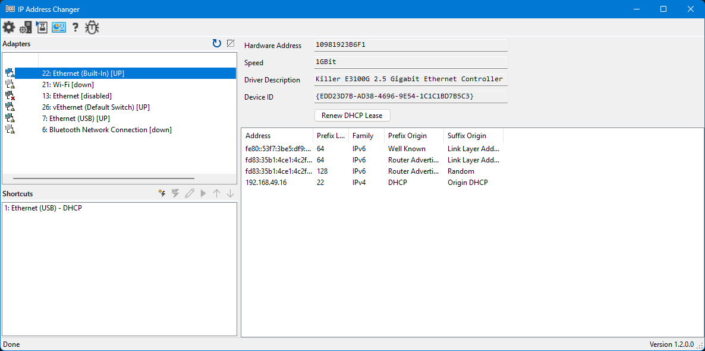

### Layout
The main window is divided into four areas: [Adapters List](#adapters-list), [Shortcuts List](#shortcuts-list), [Adapter Details](#adapter-details), and [Adapters Addresses List](#adapter-addresses-list). The relative sizes of each area may be changed by dragging the bar between the areas (sizes are saved on exit).

### Main Tool Bar

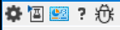

#### Settings
Displays the settings window.

#### DHCP Server
Displays the DHCP server window.

#### Debug
Displays the debug messages window.

#### Control Panel
Launches the network adapters control panel.

#### Help
Shows the program documentation.

#### Feedback
Launches a browser window to [submit bug reports](#reporting-bugs) and feedback.

### Status Bar

Shows what the software is currently doing or the results of the last operation, as well as the current version of the software.

### Adapters Tool Bar

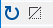

#### Refresh
Refresh the list of adapters.

#### Hide Offline Adapters
Toggles hiding and showing offline adapters.

### Shortcuts Tool Bar

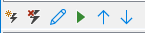

#### New Shortcut
Creates a new address configuration shortcut for the currently selected network adapter.

#### Delete Shortcut
Deletes the currently selected shortcut.

#### Edit Shortcut
Edits the currently selected shortcut.

#### Recall Shortcut
Sets the adapter configuration information for the adapter referenced in the currently selected shortcut.

#### Move Shortcut Up
Moves the shortcut up in the list of shortcuts.

#### Move Shortcut Down
Moves the shortcut down in the list of shortcuts.

### Adapters List

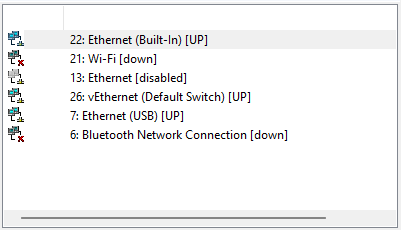

This list shows all of the network adapters present in the system. Each line shows the current adapter index (this may changed after a reboot but it doesn't affect the shortcuts), the adapter name, and its up/down/disabled state. (The icons correspond to up, down, or disabled; they look awful right now, someday they'll look better.)

Selecting an adapter will display additional details in the [Adapter Details](#adapter-details) area and associated addresses in the [Adapter Addresses List](#adapter-addresses-list). Selecting a disabled adapter will only show "Adapter disabled" in the addresses list.

Double-clicking an adapter will create a new shortcut for that adapter.

#### Adapter Context Menu

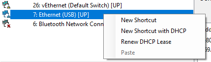

Right-clicking an adapter shows a context menu with the following items:

##### New Shortcut
Creates a new empty shortcut for this adapter.

##### New Shortcut with...
Pre-fills the new-shortcut dialog with this adapter's currently configured method — either `DHCP` (if the adapter is set to acquire its address via DHCP) or the adapter's first IPv4 address and prefix length. Disabled when the adapter has neither (e.g. an adapter with no IPv4 configuration). The menu label shows what will be pre-filled, e.g. *New Shortcut with 10.0.0.69/16*.

##### Renew DHCP for Adapter
Same action as the [Renew DHCP Lease](#renew-dhcp-lease) button in the [Adapter Details](#adapter-details) area. Enabled only when the adapter has IPv4 DHCP configured.

##### Paste *value*
Applies an IP/CIDR or `DHCP` value from the clipboard directly to this adapter, with the same workflow as recalling a shortcut. The menu label shows the value that will be pasted, e.g. *Paste 10.0.0.69/16* or *Paste DHCP*. Disabled when the clipboard does not contain a valid IPv4/CIDR or `DHCP` string.

Note that the address in the clipboard does not have to have come from this software, if you copy a valid IP address and network prefix in CIDR notation or the literal string `DHCP`, the software will use that value to paste. If the IP address is invalid (like `123.456.789.12`), the paste feature will ignore it. Addresses with leading zeroes in an octet (`010.001.001.001`) will also be ignored.

A pre-apply check refuses to assign an IP that is already in use on a different adapter on the same system, before any changes are made to this adapter.

### Shortcuts List

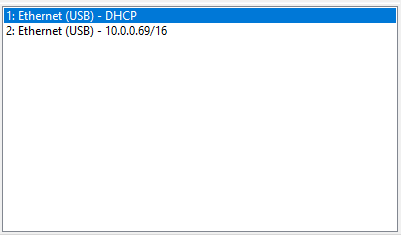

This list shows all of the stored configuration preset shortcuts.

Double-clicking a shortcut will either edit the shortcut or recall the shortcut, depending on the value of the [Start minimized](#start-minimized) setting.

These shortcuts are also available in the Shortcuts menu of the [Notification Area Icon Menu](#notification-area-icon-menu).

#### Shortcut Context Menu
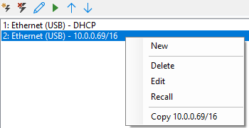

Right-clicking a shortcut shows a context menu with the following items:

##### New
Creates a new shortcut.

##### Delete
Deletes the selected shortcut.

##### Edit Shortcut
Opens the [New/Edit Shortcut Window](#newedit-shortcut-window) for the selected shortcut.

##### Recall
Applies the selected shortcut to its associated adapter.

##### Copy *value*
Copies the shortcut's value (IP/CIDR or `DHCP`) to the clipboard. The clipboard contents can then be pasted onto any adapter via the [Paste](#paste-value) item on the adapter context menu.

### Adapter Details

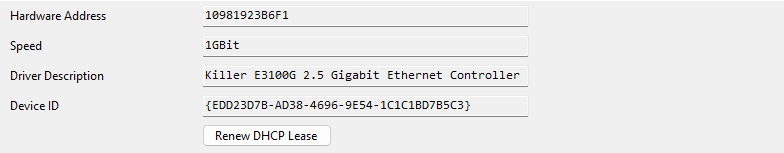

#### Hardware Address
The unformatted hardware address of the adapter (usually the MAC address for an Ethernet device)

#### Speed
The one-way data rate of the adapter in scaled bits per second (bits, kilobits, megabits, etc.).

#### Driver Description
The description of the driver that is used to interface with the adapter hardware.

#### Device ID
The unique identifier of this adapter.

#### Renew DHCP Lease
Releases and renews the DHCP lease on this adapter. Enabled only when the adapter has IPv4 DHCP configured. The renew operation may take some time. While the process is underway, the [Adapter Busy Dialog](#adapter-busy-dialog) is displayed. It can be dismissed while the process continues in the background (additional operation on this adapter will be blocked until the process is complete). DHCP renewal errors will be shown in the [debug window](#debug-messages-window) and also in a popup dialog.

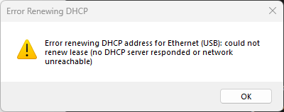

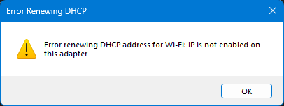

After a successful renew, the status bar suggests using [Refresh](#refresh) to update the address list with the new lease.

### Adapter Addresses List

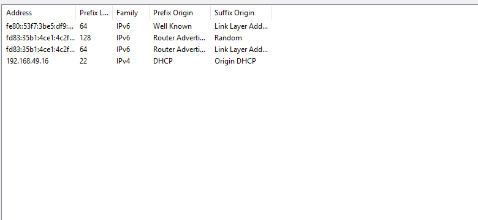

This shows all of the addresses configured for the selected adapter. You may resize and rearrange the columns (size and position will be saved on exit).

Double-clicking an address will create a shortcut for the adapter using that address and prefix length or DHCP.

#### Address
The address value for this address.

#### Prefix Length
The number of bits of the address that are used for the network segment.

#### Family
The address family this address uses.

#### Prefix Origin
The origin of the network portion of the address.

#### Suffix Origin
The origin of the host portion of the address.

#### Adapter Addresses Context Menu

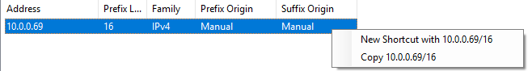

##### New Shortcut with *value*
Opens the new shortcut dialog pre-filled with the selected address (or `DHCP`).

##### Copy *value*
Copies the selected address value or `DHCP` to the clipboard.

## Notification Area Icon
The notification area icon appears in the notification area of the task bar near the clock (you may need to click the expand button to see it). Double-clicking the icon will show the application. Right clicking it will show a quick-access menu.

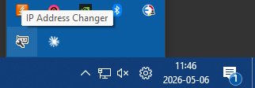

### Notification Area Icon Menu

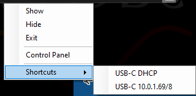

#### Show
Shows the application.

#### Hide
Hides the application (it will not appear on the taskbar, but the icon remains in the notification area).

#### Exit
Closes the application.

#### Control Panel
Launches the network adapters control panel.

#### Shortcuts
This menu contains all of the configured network adapter shortcuts. It is the same list as the [Shortcuts List](#shortcuts-list). Clicking one of these items will recall that shortcut.

## New/Edit Shortcut Window
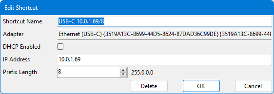

### Shortcut Name
This is the name you will see in the [Shortcuts List](#shortcuts-list) and in the [Notification Area Icon Menu](#notification-area-icon-menu).

When creating a new shortcut, this name will be automatically generated until you manually edit the name, but after you edit it manually it will retain whatever value you provide.

### Adapter
The name and device ID of the adapter this shortcut applies to, for reference.

### DHCP Enabled
Check this to use DHCP for this shortcut instead of specifying an address (the IP Address and Prefix Length fields are disabled while the DHCP checkbox is checked).

### IP Address
The IP address to use for this shortcut.

### Prefix Length
The length of the network portion of the address to use for this shortcut. For IPv4 addresses, the subnet mask is automatically displayed as well.

### Delete Button
When editing an existing shortcut, you can instead choose to delete the shortcut from this window.

## Adapter Busy Dialog
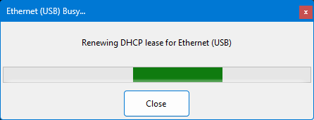

When an operation that mutates an adapter (recalling a shortcut, pasting an address, or renewing a DHCP lease) is in flight, a non-modal busy dialog appears for that adapter showing the current step. The dialog can be dismissed without aborting the operation, but closing it just hides the progress indicator while the operation continues in the background. If a second action is attempted on the same adapter while it is still busy, the dialog re-shows itself rather than starting a new operation.

Operations on different adapters run in parallel, and each gets its own busy dialog. The rest of the UI (selecting other adapters, viewing details, opening Settings, etc.) remains responsive throughout.

## Address Conflict Warning
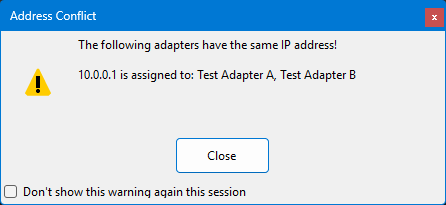

After a refresh, if the application detects that two or more adapters are sharing the same IP address, a warning dialog is shown listing each conflict.

The dialog has a "do not show again" checkbox; checking it suppresses future conflict warnings for the remainder of the session.

The application also performs a pre-apply check before assigning a static IP, refusing to create a conflict in the first place if it can detect one. The post-refresh warning catches conflicts that arise from outside the application or from operations that bypass the pre-apply check.

## DHCP Server
The application includes a DHCP server that can hand out leases on a chosen network adapter. The window is opened from the [DHCP Server](#dhcp-server) toolbar button on the main window.

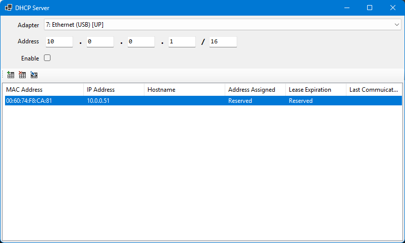

The window is divided into a configuration area along the top, and the [lease list](#dhcp-lease-list) below. Settings entered into this window are saved to prevent having to reenter everything each time the application is launched. If the bound adapter is not present, you must select a new adapter.

**Warning:** _Running a DHCP server on a corporate or school network can be very bad! It could cause network issue with other clients, it could cause issues with network hardware like routers, and it could even alert IT/security that there is an intruder. **Make sure that you select an adapter on an isolated network or that you have permission to run a DHCP server on a LAN!**_

### First-Use Warning

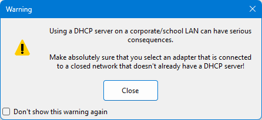

The first time the DHCP Server window is opened in a session, a warning appears explaining that running a DHCP server affects other devices on the network and should be done deliberately.

### Windows Defender Firewall
The first time you start the DHCP server, you will probably see a Windows firewall warning. This is because the server is trying to listen for incoming messages on port 67, and Windows Defender wants to make sure incoming data is allowed by the user. You should click Show more and make sure both Public networks and Private networks are checked, and then click Allow.

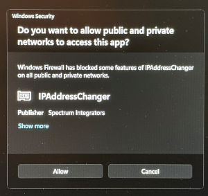
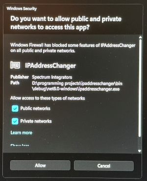

If you don't see the firewall warning and the DHCP server isn't working, chances are that when it did appear you or someone else chose to disallow the incoming connections and that decision was remembered. Open the [Windows Defender Firewall with Advanced Security](https://learn.microsoft.com/en-us/windows/security/operating-system-security/network-security/windows-firewall/tools) (Run: `wf.msc`), select Inbound Rules, and find IPAddressChanger. If it shows a red "no" icon, double-click it and change Action to "Allow the connection" and click OK. Do this for both public and private networks, if listed.

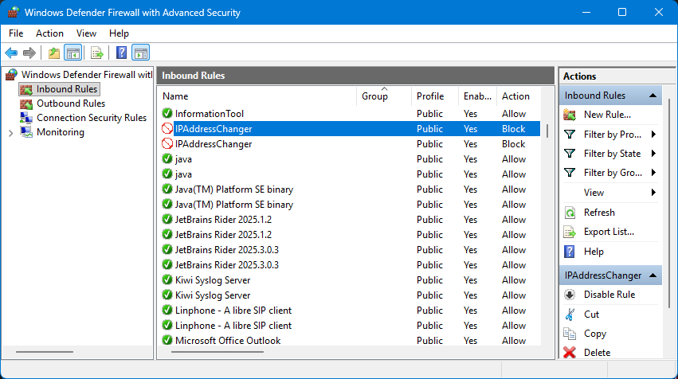
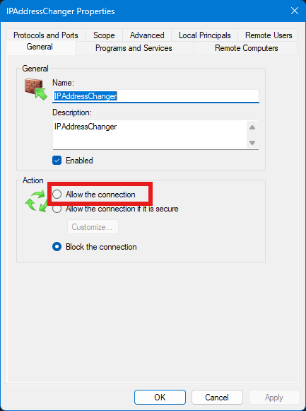

### Adapter Selection
The **Adapter** dropdown lists all network adapters and chooses which adapter the DHCP server will bind to. You may select any adapter, but in order to enable the DHCP server the adapter must be enabled and connected. The selected adapter is saved and will be re-selected the next time the application is launched (if the adapter is present).

The **Refresh** button next to the dropdown re-queries the system for the current list of adapters.

The dropdown and Refresh button are both disabled while the server is running. To switch adapters, [disable the server](#enable-dhcp-server) first.

### Address and Prefix Entry
The four octet textboxes plus the prefix-length textbox specify the IP address the server will bind to and the subnet it serves. They behave as a single logical field for entry: typing `.`, `/`, or `\` advances focus to the next box, so you can enter `10.0.0.1/24`, `10/0/0/1/24`, or whatever feels natural. Pressing Backspace on an empty box jumps back to the previous box and trims a character off the end of its content. (Typing a third digit does not automatically advance to the next field, you must press `.` or tab or click the next field.)

If the entered IP is the network address of the subnet (e.g. `10.0.0.0/24`), it is automatically adjusted to the first usable host (`10.0.0.1` in the example) when the server is enabled, with the textboxes updated to reflect the change. The same is true if the broadcast address is entered, it will be automatically adjusted down by one. The DHCP server does not have to be at the first available address in a subnet, you may manually specify any other address.

The IP address and prefix length are saved across launches and re-populated on the next open of the DHCP Server window. Bounds on the prefix length are documented in [Prefix Length Policy](#prefix-length-policy) below.

### Enable DHCP Server
The **Enable DHCP server** checkbox starts and stops the server. Checking it runs through the configuration sequence:
1. Optional [DISCOVER pre-flight check](#dhcp-discover-preflight-check) (described below).
2. Disable Windows DHCP client on the bound adapter, if it's currently enabled there. (The DHCP server can't share the adapter with the DHCP client.)
3. Add the configured IP address and prefix to the adapter, if it isn't already.
4. Remove any other IPv4 addresses from the adapter, so the DHCP server is the only IPv4 identity on the wire.
5. Bind the listener socket on UDP port 67. (There's a brief retry loop here — Windows can take a couple of seconds between "address visible in management" and "Bind() works.")

Each step shows progress in the [DHCP Server Busy Dialog](#dhcp-server-busy-dialog), and the user can cancel mid-sequence.

Unchecking the checkbox stops the listener but does **not** undo the adapter changes. The server's IP remains bound to the adapter, and Windows DHCP client stays disabled. To restore normal DHCP-on-the-adapter behavior, manually re-enable DHCP via Windows network settings, or apply a [shortcut](#shortcuts) that selects DHCP for the adapter.

### DHCP DISCOVER Preflight Check
When you enable the DHCP server, by default the software first probes the network segment for any other DHCP servers before binding. This guards against accidentally bringing up a second DHCP server on a production network, which can cause IP conflicts and unstable client behavior. Preflight check can be disabled in [settings](#settings).

The probe sends a single DHCP `DISCOVER` broadcast out the bound adapter and listens for a few seconds for any `OFFER` replies. If any `OFFER` comes back, a dialog appears listing each responding server and the address it offered, and asks whether to start anyway:

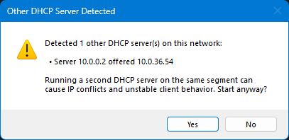

Choosing **No** aborts cleanly. The adapter is left exactly as it was, with no changes applied. If no `OFFER` arrives during the listen window, the segment is treated as clear and the server start-up continues automatically.

A non-responding probe almost always means no DHCP server is reachable on the segment. It is possible for a server to be present but happen to be slow, busy, or temporarily not issuing offers, though in practice "no response" reliably means "no server." The probe is a best-effort safety check, not a hard guarantee.

The probe also can't distinguish an authorized DHCP server from a rogue one. It detects whether *anything* on the segment is willing to issue a lease, not whether that something is supposed to be there. If you knowingly want to run a second server on a segment that already has an authorized one (lab work, controlled testing, replacing an existing server in place), the prompt is just a confirmation step to dismiss — or you can disable the pre-flight entirely from the [Settings Window](#settings-window).

The listen-window duration defaults to 5 seconds, which is appropriate for most networks. If a particular network needs more or less, the duration is exposed as the `DHCPPreflightDuration` value (in seconds) in `user.config` (it is not in the Settings window, it must be edited manually).

### Address Conflict on Server Start
The DISCOVER pre-flight catches *DHCP* servers on the segment, but it can't catch a non-DHCP device that simply happens to have the configured server IP. As a backstop, Windows runs Duplicate Address Detection (DAD) when the application adds the IP to the adapter — sending an ARP probe and watching for replies. If anything answers, the address goes into a `Duplicate` state and the listener bind fails.

When this happens, the application shows a clear message and aborts the start:

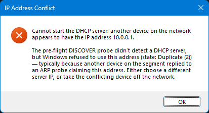

The adapter is **left in a partially-configured state** rather than rolled back automatically:

- Windows DHCP client is disabled (the start sequence got that far before the bind failure)
- The configured static IP is bound to the adapter in `Duplicate` state (Windows added it, but won't let anything bind to it)
- An APIPA `169.254.x.x` address is also bound (Windows' fallback when the primary address is unusable)

The reason for *not* rolling back: you might want to pick a different server IP and retry without re-disabling DHCP on the adapter, or take the conflicting device off the network and try again with the same IP. To restore normal connectivity instead, either retry the start with a non-conflicting IP, or re-enable Windows DHCP on the adapter via a `DHCP` shortcut or the Windows network-settings UI.

### Reservations Outside the Subnet
DHCP reservations are persisted across launches. If you re-open the application with a different server IP/prefix than the previous session — for example, switching the server from `10.0.0.0/16` to `192.168.1.0/24` — some of the existing reservations may now sit outside the new scope and be unreachable from clients on the segment.

When this is detected during server start, a prompt appears listing how many reservations fall outside the new subnet:

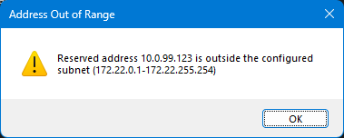

- **Yes** — drop the out-of-scope reservations and continue starting the server with a clean lease list.
- **No** — keep them in the list and start the server anyway. They won't break anything, but they won't be reachable until you switch the scope back.
- **Cancel** — abort the start. The adapter is left untouched.

### Prefix Length Policy
By default, the DHCP server accepts prefix lengths from **/8 through /30** when configuring the scope.

The **/30 upper bound** is a hard protocol limit. /31 has no usable host addresses (just two addresses, both reserved for network and broadcast) and /32 is a single host. Neither leaves room for a server plus a client, so the DHCP server can't operate at a prefix that tight.

The **/8 lower bound** is a policy choice rather than a protocol one. Anything wider has no realistic legitimate use as a DHCP scope — a /0 covers all of IPv4 and would force the server to iterate through millions of addresses linearly when looking for an unused one — and is more likely to be a typo than an intentional configuration. Setting the bound at /8 catches the typo case while still allowing the largest reasonable lab and corporate-network scopes.

If you have a legitimate reason to override these bounds (a controlled lab subnet wider than /8, for example), the limits are exposed as `DHCPPrefixMinLength` and `DHCPPrefixMaxLength` in `user.config` (not on the Settings window). Values outside the protocol-level limits (0..30 inclusive) are silently clamped, so you can loosen the policy down to /0 by editing the config, but you can't push the upper bound past /30 — that's a hard math limit the server enforces regardless of what's in the settings file.

### DHCP Lease List
The lease list shows all current leases (issued by the server to devices that asked for an address) and reservations (manually-added MAC→IP pairs that the server hands out when that MAC requests an address). Each entry has six columns:

- **MAC Address**: the device's hardware address, normalized to upper-case colon-separated form.
- **IP Address**: the address the device has, or that's reserved for it.
- **Hostname**: the device's reported hostname, taken from the DHCP request's Option 12. Empty for manual reservations until the device contacts the server, after which the hostname is filled in automatically and persists across reservations even after the device disconnects.
- **Assigned**: the timestamp when the lease was first issued. Shows `Reserved` for manual reservations.
- **Expires**: the timestamp when the lease will expire. The client is expected to renew before this. When a renewal request arrives, the timestamp is adjusted. If the client never asks for a renewal, the address is *not* automatically reclaimed. Shows `Reserved` for manual reservations.
- **Last Communication**: the most recent DHCP message exchange, formatted as `TX: DHCPACK`, `RX: DHCPREQUEST`, etc. Empty until the device first communicates after the window was opened.

Whether the lease list is persisted across launches and how is controlled by the [Save DHCP Leases](#save-dhcp-leases) setting.

**Sticky leases by design.** Leases are not automatically reclaimed when they expire. Once a device gets an IP from this server, the same IP is offered back to it on every subsequent DISCOVER. To free an address, [delete the entry](#delete-lease) explicitly.

### Tool Bar

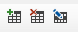

#### Add Reservation
Opens the [Add/Edit DHCP Reservation](#addedit-dhcp-reservation) dialog to create a new manual reservation. Requires that an IP address and prefix length have been selected so the dialog can validate the reservation against the scope.

#### Delete Lease
Removes the selected lease(s) or reservation(s) from the server. Does not tell the client to get a new address, it only removes the lease/reservation.

#### Edit Lease
Opens the [Add/Edit DHCP Reservation](#addedit-dhcp-reservation) dialog pre-filled with the selected entry's MAC and IP. If multiple entries are selected, only the first is edited.

### Lease Context Menu

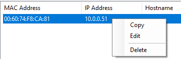

Right-clicking the lease list shows a context menu with three items:

#### Copy
Copies the selected lease(s) to the clipboard as one line per entry: `MAC = IP` (with the device's hostname in parentheses if it's known).

#### Edit
Same as the [Edit Lease](#edit-lease) toolbar button.

#### Delete
Same as the [Delete Lease](#delete-lease) toolbar button. Pressing the `Delete` key on the lease list does the same thing.

### DHCP Server Stopped Warning
If the bound adapter or its IP address is removed out from under the server while it's running, the server detects the disappearance and stops itself rather than continuing in a half-broken state. A warning dialog appears explaining what happened, and the [Enable DHCP server](#enable-dhcp-server) checkbox automatically un-checks itself.

The warning has two flavors depending on what was lost:

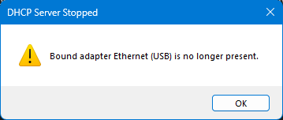

The bound adapter itself is no longer present. Common causes are that a USB-Ethernet adapter was unplugged or an adapter was disabled in Windows network settings.

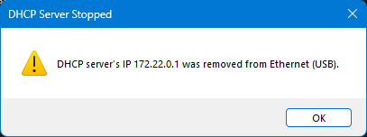

The adapter is still there, but the address the server was using was removed from it.

This is defense-in-depth on top of the safeguards that prevent the application's own [shortcuts and adapter-paste actions](#adapter-context-menu) from clobbering a running server's adapter. It catches the case where something *outside* the application changes the adapter.

### Limitations and Design Notes
A handful of things the DHCP server intentionally does not do:

- **No automatic expiry.** Once a MAC has been offered an IP, that IP stays allocated to that MAC for the rest of the session even if the device never completes the DHCP handshake. For the intended function of this program (testing, setting up equipment), this shouldn't matter even with a `/24` subnet. If the [Save DHCP addresses](#save-dhcp-leases) setting is set to "Save reserved and automatic addresses," you may need to manually delete some after a while.
- **DHCPRELEASE intentionally ignored.** Same root cause as the sticky-lease behavior — the MAC→IP mapping is permanent. A device that releases its lease (via shutdown or explicit release) will still get the same IP the next time it asks.
- **DHCP relays (`giaddr`) not handled.** The server only works on a single broadcast segment. If you're using a DHCP relay agent to forward requests from another subnet, this server won't talk to it.
- **Client-identifier (Option 61) not used.** All clients are tracked by hardware address (chaddr/MAC). RFC 2131 §4.2 prefers client-id when present, but in practice almost every DHCP client uses a chaddr-based client-id, so this only matters in corner cases (some VM clones, certain enterprise DHCP clients with explicit DUIDs).
- **DHCPINFORM responds but doesn't track.** INFORM is for clients that already have an IP from somewhere else and just want gateway/DNS info — the server answers with the configured options but doesn't add a lease entry.

## DHCP Server Busy Dialog

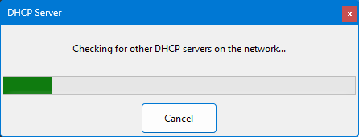

While the DHCP server is being [enabled or disabled](#enable-dhcp-server), a busy dialog shows the current step. The dialog is cancellable: cancelling stops the sequence at the next checkpoint between operations; an in-flight CIM/WMI call is allowed to finish first to avoid leaving the adapter in an unknown intermediate state.

Cancellation during the start sequence leaves the adapter in whatever partial state it had reached (e.g. DHCP disabled but no static IP added yet). Re-enabling the server picks back up from where the prior attempt stopped, so a cancelled-then-retried start usually completes cleanly. To fully restore the adapter to a known state after cancelling, apply a shortcut to set the adapter's address or enable its DHCP client.

## Add/Edit DHCP Reservation

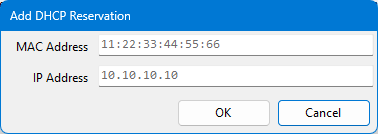

This dialog is used to create a new DHCP reservation or edit an existing one. When editing, both the MAC address and IP address are editable; either or both can be changed in a single edit. Duplicate-detection runs on submit and rejects the change if the new MAC or IP would collide with another existing reservation.

The MAC address field accepts colon (`AA:BB:CC:DD:EE:FF`), dash (`AA-BB-CC-DD-EE-FF`), dot (`AABB.CCDD.EEFF`), and unseparated (`AABBCCDDEEFF`) formats; the input is normalized to colon-separated upper-case before being stored. The IP address must fall within the configured (or about-to-be-configured) DHCP scope.

## Settings Window
This window allows changing the functionality of the program.

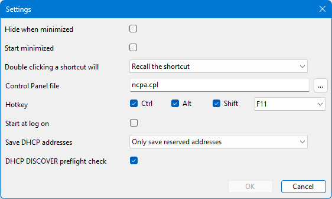

### Hide when minimized
Hides the window from the task bar when it is minimized (it can be shown again from the [Notification Area Icon Menu](#notificaion-area-icon-menu)).

### Start minimized
Automatically minimizes the application as soon as it launches. (If Hide when minimized is checked, it will also be hidden at launch.) The [Notification Area Icon](#notification-area-icon) is still available for shortcuts and to show the application. (The window may still appear briefly before minimizing; this is annoying but I haven't gotten around to fixing it yet.)

### Double clicking a shortcut will
Chooses what action to perform when a shortcut from the [Shortcuts List](#shortcuts-list) is double-clicked: edit the selected shortcut, or recall the selected shortcut.

### Control Panel file
Path to the network adapters control panel file. This should be able to be left to the default value (`ncpa.cpl`), but if for some reason that file is moved or not available on your system, any other file may be specified here and it will be launched when the [Control Panel](#control-panel) button is clicked.

### Hotkey
Pressing the key combination set here will show and bring the window to the front. (The default is `Ctrl + Alt + Shift + F11`)

### Start at log on
When this is checked, a task scheduler event is created to launch the program when you (you, not any other user) logs on to Windows. (Actually there's a 30 second delay because if it's too fast the taskbar icon doesn't get created and I can't be bothered to fix it.) The task is created to run with the highest privileges, so you won't get the UAC dialog if the program starts at log on.

### Save DHCP Leases
Controls what entries from the [DHCP server's lease list](#dhcp-lease-list) are persisted across launches. Two options:

- **Only save reserved addresses** (default) — only manually-created reservations are saved. Server-issued leases (where the device contacted the server and was given an address dynamically) are forgotten when the application closes.
- **Save reserved and automatic addresses** — all entries, both reservations and server-issued leases, are saved.

A subtle round-trip note for the second option: when saved leases are reloaded on the next launch, they all come back as reservations regardless of which type they were originally. The MAC→IP mapping is preserved, but `Assigned` and `Expires` are not. A device that previously had a dynamic lease will have a reservation pointing at its IP on next launch.

### DHCP DISCOVER preflight check
When checked, the [pre-flight DISCOVER probe](#dhcp-discover-preflight-check) runs before the server is enabled. Default is on. Uncheck if you're working in an environment where you knowingly want to start a second DHCP server on a segment that already has one (lab work, controlled testing, replacing an existing server in place) and don't want to dismiss the prompt every time.

### Resetting the Settings
If for some reason your settings get hosed (for example, if somehow it stores the window size to be microscopically small), you can hold down the `Shift` key while the program launches to reset all of the settings to their default values.

### Settings File Location
Some settings are not able to be changed in the Settings window and must be edited manually. These settings _should_ not ever need to be changed, but they are configurable by advanced users for rare cases where it's necessary. The settings file is printed in the [debug messages window](#debug-messages-window) near the program start, it will be in `%LOCALAPPDATA%/Spectrum_Integrators/IPAddressChanger_Url_<id>/<version>/user.config`. Don't fiddle about with settings you don't understand.

## Debug Messages Window
This window shows additional information about the actions the program is performing and the results of those actions. Note: this will delete all of your shortcuts too!

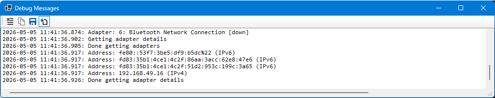

### Tool Bar

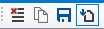

#### Clear Log
Clears all entries from the debug messages log.

#### Copy Messages
Copies all of the selected debug messages to the clipboard.

#### Save Log
Saves the entire log to a file.

#### Auto Scrolling
Toggles whether the log jumps to the bottom each time a new message arrives. When the button is checked, each new message automatically scrolls into view; when unchecked, the view stays where it is and you can read older messages without being yanked back to the bottom.

Auto-scroll is disabled when you scroll the log manually (mouse wheel, scrollbar, arrow keys, etc.) so you can pause the auto-scroll just by interacting with the list.

### Debug Messages
This list contains all of the debug messages. Clicking a line will select it, using `Ctrl` and `Shift` will allow selecting multiple items.

`Ctrl+C` will copy selected items to the clipboard. `Ctrl+A` will select all items.

## Privilege Elevation & UAC Prompt

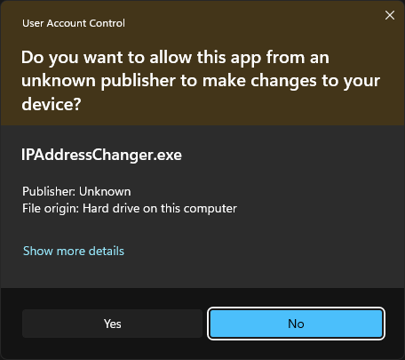

Privilege elevation is required to make changes to network configuration. The Settings app and `ncpa.cpl` route changes through the Network Connections service, which is already elevated and checks the caller's permissions itself — hence no UAC prompt. This application calls CIM/WMI directly, and those providers check the calling process's token, so the application has to be elevated up front. That's the UAC prompt at launch.

The software isn't digitally signed, so the UAC prompt shows "unknown publisher."

## Windows SmartScreen Warning
If you downloaded this file from the Internet, there's a good chance you'll see the Windows SmartScreen warning saying "Windows has protected your PC." This is because the application isn't digitally signed and known to be safe by Microsoft. The path to fixing this is too long and expensive for an in-house tool, so you'll just have to "trust me, bro."

## Reporting Bugs
The fastest way to send feedback is the [Feedback](#feedback) toolbar button on the main window to open a browser to the bug report form. Using this method includes the software version and build information. To reach the form directly, go to https://forms.zoho.com/spectrumintegrators/form/IPAddressChangerFeedback.

If you can include the stack trace and the debug log when something goes wrong, the bug becomes a *lot* easier to fix.

### When you see an "Unhandled Exception" dialog
If something goes wrong in the program in a way I didn't anticipate, you'll see a dialog like this:

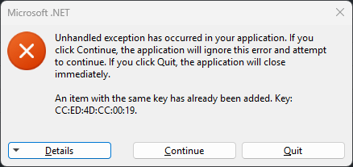

**Click "Details" — don't click "Quit".** "Continue" lets the program keep running so you can finish what you were doing and grab logs; "Quit" terminates immediately and you lose the in-memory debug log.

After clicking "Details", you'll get the expanded view with the full stack trace and the list of loaded assemblies:

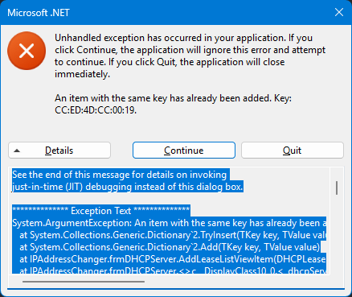

Select all of that text and copy it into the bug report. The "Exception Text" section at the top is the most useful part (it points at the exact line of code that failed), but the rest of it helps too — please send the whole thing.

### The debug log
The [Debug Messages Window](#debug-messages-window) records what the program is doing as it runs — adapter operations, DHCP server traffic, errors. If a bug is reproducible, open the debug window before you reproduce it, then use the "Copy Selected" or "Save" toolbar button afterward and attach the log to your [bug report](#reporting-bugs). The combination of stack trace + debug log is usually enough to pinpoint the issue.

### A note on privacy
The "Loaded Assemblies" section of the unhandled-exception details includes full file paths to assemblies on your system, which can include your Windows username (e.g., `C:\Users\YourName\...`). That's normally harmless, but if you'd rather not share it, feel free to redact those paths before sending — just leave the "Exception Text" / stack trace section intact since that's where the diagnostic value is.

## Glossary
- **ACK** — Acknowledgment
- **APIPA** — Automatic Private IP Addressing
- **ARP** — Address Resolution Protocol
- **CIDR** — Classless Inter-Domain Routing
- **CIM** — Common Information Model
- **DAD** — Duplicate Address Detection
- **DHCP** — Dynamic Host Configuration Protocol
- **DNS** — Domain Name System
- **DPI** — Dots Per Inch
- **DUID** — DHCP Unique Identifier
- **IP** — Internet Protocol
- **IPv4** — Internet Protocol version 4
- **IPv6** — Internet Protocol version 6
- **MAC** — Media Access Control
- **NAK** — Negative Acknowledgment
- **RFC** — Request for Comments
- **RX** — Receive
- **TX** — Transmit
- **UAC** — User Account Control
- **UDP** — User Datagram Protocol
- **USB** — Universal Serial Bus
- **VM** — Virtual Machine
- **WMI** — Windows Management Instrumentation

## Things I Haven't Tested
If you find a bug, [use the bug report feature](#reporting-bugs). But there are some things that I know might not work well and I just can't be bothered to test for since this is a limited-audience tech tool.

* Different font DPI settings - may make text in forms cropped and unreadable
* Different window scaling settings - this should be OK but different elements on the form may not scale correctly or proportionately
* IPv6 - the software is generally aimed at IPv4 (and dotted-decimal addresses specifically), though it is possible to create IPv6 shortcuts

## AI Disclosure
This project was completed before AI coding agents were a thing, but recent revisions have used the aid of an agent for refactorings and documentation. (Release [1.0.5.1](https://github.com/SpectrumIntegrators/IPAddressChanger/releases/tag/v1.0.5.1) was the last non-AI-assisted release.) It's still human-developed with all of the code reviewed by a human and much of it continues to be written by a human.

## Copyright
	IP Address Changer - Windows GUI application to quickly change network address settings.
    Copyright (C) 2024-2026 Jonathan Dean (jonathand at spectrumintegrators.com)

    This program is free software: you can redistribute it and/or modify
    it under the terms of the GNU General Public License as published by
    the Free Software Foundation, either version 3 of the License, or
    (at your option) any later version.

    This program is distributed in the hope that it will be useful,
    but WITHOUT ANY WARRANTY; without even the implied warranty of
    MERCHANTABILITY or FITNESS FOR A PARTICULAR PURPOSE.  See the
    GNU General Public License for more details.

    You should have received a copy of the GNU General Public License
    along with this program.  If not, see <https://www.gnu.org/licenses/>.